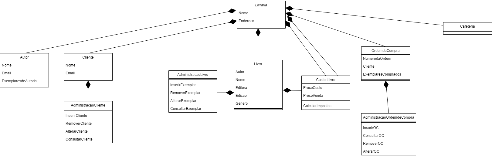

# Lista4Ces22

Para o inicio do projeto, a livraria foi escolhida para ser a classe pai de outras 4 classes: Livro, OrdemdeCompra, Autor e Cliente. Os atributos de Livraria são seu
nome e sua localizacao geográfica. Para a classe Autor, seus atributos são Nome, Email e Exemplares, que representa quais exemplares ele escreveu. Para Cliente, seus
atributos são Nome e Email. Foi cogitado escrever também um atributo para os exemplares que ele possui, porém isso pode ser regatado pela classe Ordem de Compra. Para
Livro, seus atributos são Autor, Nome, Editora, Edicao e Genero, enquanto para OrdemdeCompra são NumerodaOrdem, Cliente e ExemplaresComprados. Para as classes de
Cliente, Livro e OrdemdeCompra, cada uma possui uma subclasse Administracao associada, que possuem os respectivos modulos de Inserir, Remover, Alterar e Consultar.
Por fim, a classe Livro tambem possui uma subclasse CustosLivro, que realiza calculos sobre os custos dos exemplares e armazena essas informacoes.
Para implementação de um novo produto, como a cafeteria, é necessário a adição de uma subclasse que herda de livraria, com seus devidos atributos. Para alterar criar 
produtos para cafeteria ou alterar algum de seus atributos, outras subclasses que herdam dela devem ser criadas para essa finalidade. Abaixo está o diagrama de classes
do projeto:

